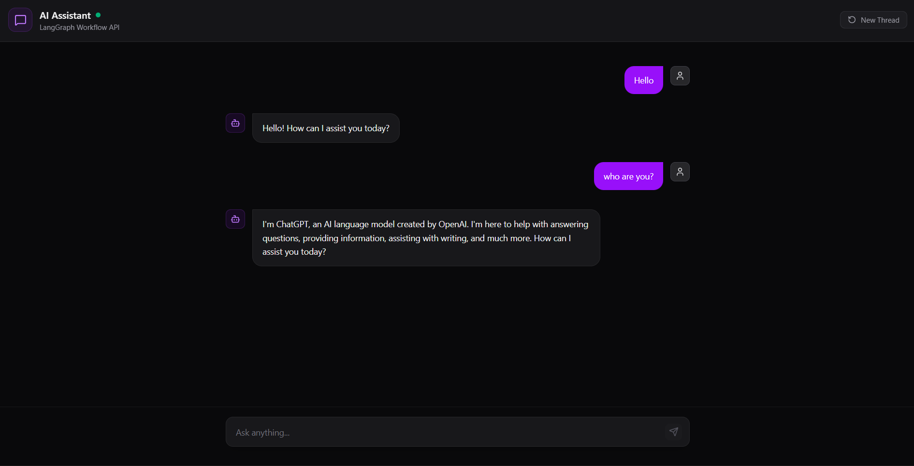

# AI Chatbot — LangGraph + Flask + React

A conversational chatbot web application powered by **LangGraph** and **OpenAI**, served through a **Flask** REST API, with a **React + Tailwind CSS** frontend styled as a dark-mode chat interface.

## Features

- Conversational chatbot backed by a LangGraph workflow (`StateGraph`)
- Persistent conversation memory per session via LangGraph's checkpointer (`MemorySaver`)
- Clean dark-mode chat UI
- User and bot messages visually separated — user messages right-aligned, bot messages left-aligned
- Simple REST API connecting frontend and backend



## Tech Stack

**Backend**
- Python, Flask
- LangGraph
- LangChain (`langchain-openai`)
- OpenAI API (`gpt-4.1-mini`)
- flask-cors

**Frontend**
- React (Vite)
- Tailwind CSS

## Project Structure

```
chatbot-app/
├── backend/
│   ├── app.py            # Flask entry point (routes, CORS)
│   ├── graph.py           # LangGraph workflow (StateGraph, chat_node)
│   ├── requirements.txt
│   └── .env               # OPENAI_API_KEY (not committed)
│
├── frontend/
│   ├── public/
│   ├── src/
│   │   ├── components/
│   │   │   ├── ChatWindow.jsx
│   │   │   ├── MessageBubble.jsx
│   │   │   ├── ChatInput.jsx
│   │   │   └── Header.jsx
│   │   ├── App.jsx
│   │   ├── main.jsx
│   │   └── index.css
│   ├── package.json
│   ├── tailwind.config.js
│   └── vite.config.js
│
└── README.md
```

## How It Works

1. The user types a message in the React chat UI.
2. The frontend sends a `POST /chat` request to the Flask backend with the message and a `thread_id`.
3. Flask invokes the LangGraph `workflow`, which runs the message through `chat_node` (calling the OpenAI model).
4. LangGraph's `MemorySaver` checkpointer keeps track of conversation history per `thread_id`.
5. The bot's response is returned to the frontend and rendered as a left-aligned message bubble.

## API Reference

**POST** `/chat`

Request body:
```json
{
  "message": "Hello",
  "thread_id": "abc123"
}
```

Response body:
```json
{
  "response": "Hi there! How can I help you today?"
}
```

## Getting Started

### Prerequisites
- Python 3.10+
- Node.js 18+
- An OpenAI API key

### Backend Setup
```bash
cd backend
python -m venv venv
source venv/bin/activate      # On Windows: venv\Scripts\activate
pip install -r requirements.txt
```

Create a `.env` file in `backend/`:
```
OPENAI_API_KEY=your_openai_api_key_here
```

Run the backend:
```bash
python app.py
```

### Frontend Setup
```bash
cd frontend
npm install
npm run dev
```

The app will be available at `http://localhost:5173` (frontend) with the backend running at `http://localhost:5000`.

## Future Improvements
- Streaming responses instead of full-response replies
- Multiple chat threads / conversation history sidebar
- User authentication
- Persistent storage (database) instead of in-memory checkpointing

## License
This project is licensed under the MIT License.
